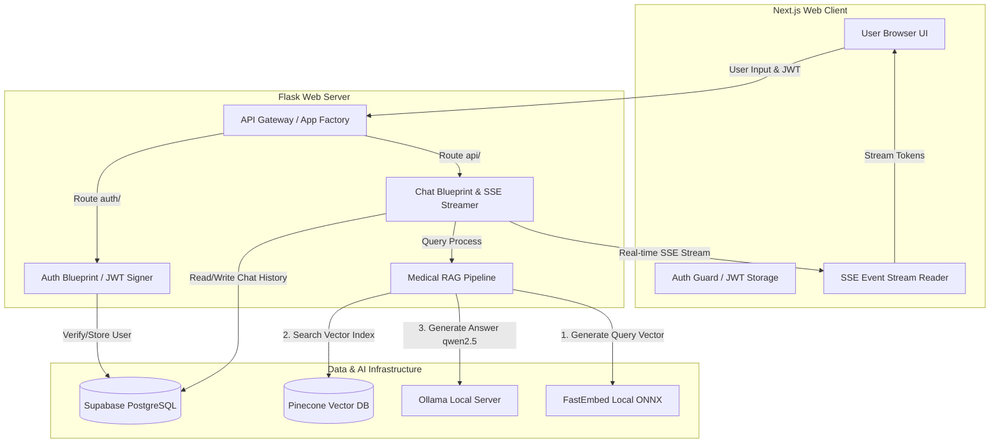

# 🩺 MedBot AI: Localized Clinical RAG Assistant

[](https://nextjs.org/)
[](https://flask.palletsprojects.com/)
[](https://ollama.com/)
[](https://www.pinecone.io/)
[](https://supabase.com/)

MedBot AI is a secure, localized Medical AI chat assistant designed to answer clinical queries accurately based on verified medical documentation. Using a robust **Retrieval-Augmented Generation (RAG)** pipeline, MedBot cross-references user queries against the *Gale Encyclopedia of Medicine* before generating responses. Built-in hallucination guards and a sub-millisecond local embedding engine guarantee that response generation is grounded in facts, highly relevant, and completely private.

---

## 📖 Table of Contents
1. [Key Features](#-key-features)
2. [System Architecture](#%EF%B8%8F-system-architecture)
3. [Project Directory Structure](#-project-directory-structure)
4. [Prerequisites](#-prerequisites)
5. [Environment Configuration](#%EF%B8%8F-environment-configuration)
6. [Data Ingestion Setup](#%EF%B8%8F-data-ingestion-setup)
7. [Running the Application](#-running-the-application)
8. [Testing & Verification](#-testing--verification)
9. [Relational Database Schema](#%EF%B8%8F-relational-database-schema)
10. [Medical Disclaimer](#-medical-disclaimer)

---

## 🌟 Key Features

*   **Offline Semantic Retrieval**: Queries are embedded locally using **FastEmbed** (`nomic-embed-text-v1.5`) via ONNX runtime for sub-millisecond vectorization, bypassing network latency.
*   **Vector Query Matching**: Integrates with **Pinecone Vector Database** (using Cosine Similarity) to match queries against PDF text chunks.
*   **Hallucination Guards**: Implement a strict similarity threshold ($Score \ge 0.55$). If the query's similarity to the knowledge base is below this score, the LLM refrains from responding, yielding: *"I don't know based on the available medical data."*
*   **Ollama Orchestration**: Connects to a local Ollama instance running a specialized `qwen2.5:0.5b` model tuned with systemic instructions to rely only on verified medical facts and cite page numbers.
*   **Real-time Streaming (SSE)**: Delivers responses token-by-token using **Server-Sent Events (SSE)** for responsive rendering.
*   **Secure Authentication**: Custom user registration, hashing (bcrypt), and JWT-based authentication guards session ownership and query history.
*   **Persisted Interactions**: Stores and retrieves conversation histories, page-number citations, and user sessions inside **Supabase PostgreSQL**.

---

## 🏗️ System Architecture

The following diagram details the data flow between the client browser, API routes, security guards, RAG processing layers, and the underlying data storage components:



---

## 📁 Project Directory Structure

```
Medical AI chatBot/
├── medbot/
│   ├── backend/
│   │   ├── app/                # Flask App & blueprints (auth, chat)
│   │   │   ├── chat/           # RAG logic, SSE stream, and Pinecone clients
│   │   │   ├── db/             # Supabase clients & relational queries
│   │   │   ├── models/         # User and Session models
│   │   │   └── config.py       # Configuration parser & validator
│   │   ├── data/               # Place 'gale_encyclopedia.pdf' here
│   │   ├── scripts/            # Setup, ingestion, and verification tests
│   │   │   ├── ingest.py       # Parses PDF and indexes vectors to Pinecone
│   │   │   ├── test_db.py      # Database CRUD operation check
│   │   │   ├── test_rag.py     # Standalone RAG pipeline verification
│   │   │   └── test_sse.py     # Server-Sent Events output verification
│   │   ├── .env                # Backend configuration variables
│   │   └── requirements.txt    # Python service dependencies
│   │
│   ├── frontend/
│   │   ├── app/                # App Router Layouts, Chat Panel, Login Pages
│   │   ├── components/         # Shared frontend components (e.g. AuthGuard)
│   │   ├── next.config.ts      # Configures proxy rewrites to bypass CORS
│   │   └── package.json        # Next.js Node dependencies
│   │
│   └── docker-compose.yml      # Docker Orchestration config
│
├── architecture.md             # Comprehensive Architecture Specs
├── run_project.bat             # Windows batch-file project launcher
└── README.md                   # Project documentation (this file)
```

---

## ⚡ Prerequisites

To run this application locally, you will need:
*   **Python 3.10 or 3.11**
*   **Node.js 18+** & **npm**
*   **Ollama Installed & Running**
    *   Pull the base LLM: `ollama pull qwen2.5:0.5b`
    *   Pull the base Embeddings model: `ollama pull nomic-embed-text`
*   **Pinecone Account** (Free tier is sufficient)
*   **Supabase Account** (For relational DB)

---

## ⚙️ Environment Configuration

Create a `.env` file under `medbot/backend/` using the template below:

```ini
# Flask Configuration
FLASK_ENV=development
FLASK_DEBUG=True
PORT=5000
SECRET_KEY=your-dev-secret-key-here

# Supabase Credentials
SUPABASE_URL=https://<your-project-id>.supabase.co
SUPABASE_KEY=<your-anon-or-service-role-key>

# Pinecone Credentials
PINECONE_API_KEY=<your-pinecone-api-key>
PINECONE_INDEX_NAME=medbot

# Ollama Configuration
OLLAMA_BASE_URL=http://localhost:11434
LLM_MODEL=medbot
EMBEDDING_MODEL=nomic-embed-text

# Local Model Tuning
LLM_NUM_PREDICT=512
LLM_NUM_THREAD=8
```

---

## 🛠️ Data Ingestion Setup

The ingestion pipeline parses the medical encyclopedia, generates vector embeddings, and stores them in Pinecone.

1.  **Place the PDF File**: Ensure the file `gale_encyclopedia.pdf` is placed in `medbot/backend/data/`.
2.  **Initialize local virtual environment**:
    ```bash
    cd medbot/backend
    python -m venv venv
    .\venv\Scripts\activate
    pip install -r requirements.txt
    ```
3.  **Build Custom Ollama Model**:
    Create the custom medbot model with specialized instructions using the provided `Modelfile`:
    ```bash
    ollama create medbot -f Modelfile
    ```
4.  **Run the Ingestion Script**:
    ```bash
    python scripts/ingest.py
    ```
    *Note: The script splits the text into chunks of 500 tokens (50 overlap), embeds them using local embeddings, and uploads them to a 768-dimensional Pinecone index.*

---

## 🚀 Running the Application

### Option A: Windows Quick Launcher (Recommended)
Double-click the `run_project.bat` script in the root directory. This will automatically spawn two CLI instances:
1.  **Flask Backend**: Running at `http://localhost:5000`
2.  **Next.js Dev Server**: Running at `http://localhost:3000`

### Option B: Docker Compose
If you prefer running inside containers, execute:
```bash
cd medbot
docker-compose up --build
```
*Note: `docker-compose` maps `host.docker.internal` so the containerized backend can query the Ollama server running on your host machine.*

### Option C: Manual Launch
**Start Backend:**
```bash
cd medbot/backend
.\venv\Scripts\activate
set FLASK_APP=app:create_app()
python -m flask run --port 5000
```

**Start Frontend:**
```bash
cd medbot/frontend
npm install
npm run dev
```

---

## 🧪 Testing & Verification

The project includes several standalone scripts inside `medbot/backend/scripts/` to verify configurations and dependencies:

1.  **Database Connection Check**:
    Validates Supabase connection, inserts a test user, creates a session, writes a test message, and cleans up:
    ```bash
    python scripts/test_db.py
    ```

2.  **RAG Standalone Pipeline Test**:
    Performs retrieval and generation for an in-scope question ("What is diabetes?") and verifies if the hallucination guard correctly intercepts an out-of-scope question ("What is Node.js?"):
    ```bash
    python scripts/test_rag.py
    ```

3.  **SSE Streaming Interface Verification**:
    Checks the local server endpoint's streaming outputs directly to verify Server-Sent Events flow:
    ```bash
    python scripts/test_sse.py
    ```

---

## 🗄️ Relational Database Schema

Set up the following tables in your Supabase PostgreSQL database:

```sql
-- 1. Users Table
CREATE TABLE users (
    id UUID PRIMARY KEY DEFAULT gen_random_uuid(),
    email VARCHAR(255) UNIQUE NOT NULL,
    password_hash VARCHAR(255) NOT NULL,
    created_at TIMESTAMP WITH TIME ZONE DEFAULT CURRENT_TIMESTAMP
);

-- 2. Chat Sessions Table
CREATE TABLE sessions (
    id UUID PRIMARY KEY DEFAULT gen_random_uuid(),
    user_id UUID REFERENCES users(id) ON DELETE CASCADE NOT NULL,
    title VARCHAR(255) NOT NULL,
    created_at TIMESTAMP WITH TIME ZONE DEFAULT CURRENT_TIMESTAMP
);

-- 3. Messages Table
CREATE TABLE messages (
    id UUID PRIMARY KEY DEFAULT gen_random_uuid(),
    session_id UUID REFERENCES sessions(id) ON DELETE CASCADE NOT NULL,
    role VARCHAR(50) NOT NULL CHECK (role IN ('user', 'assistant')),
    content TEXT NOT NULL,
    sources JSONB DEFAULT '[]'::jsonb,
    created_at TIMESTAMP WITH TIME ZONE DEFAULT CURRENT_TIMESTAMP
);
```

---

## ⚠️ Medical Disclaimer

> [!WARNING]
> **This software is for educational and informational purposes only.** MedBot AI is not a licensed medical professional, and the generated content does not constitute medical advice, diagnosis, treatment, or clinical recommendations. Never disregard professional medical advice or delay seeking treatment because of information read or generated through this application.