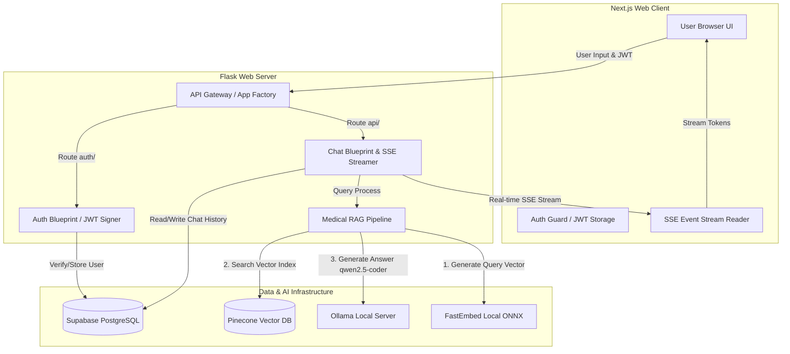
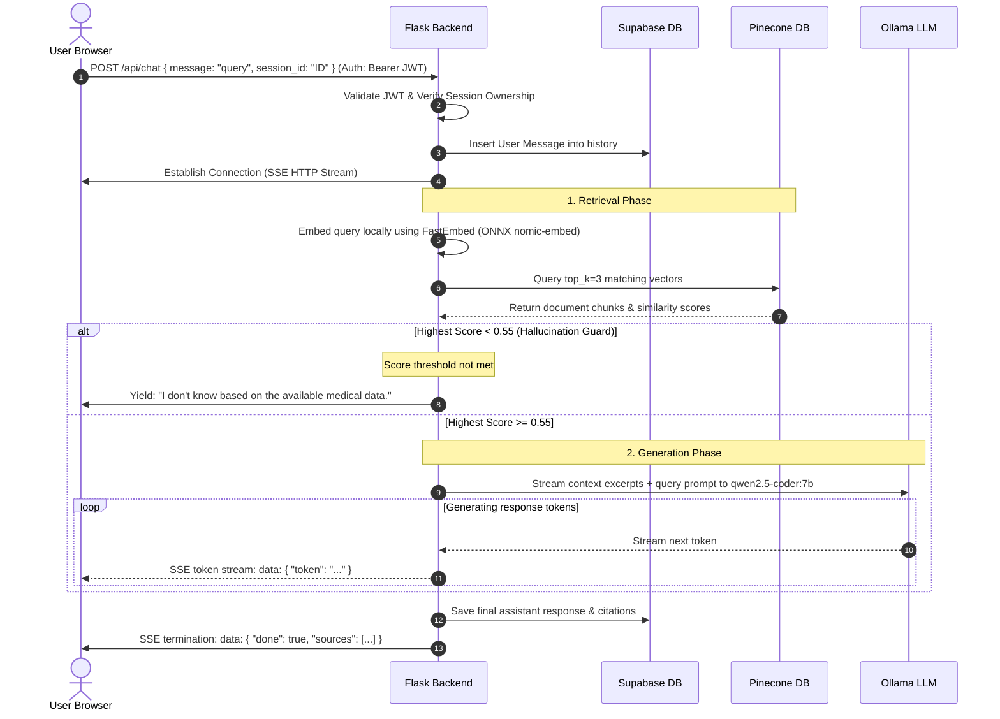

# MedBot AI - Architecture Documentation

MedBot is a localized Medical AI chat assistant designed to provide accurate answers to clinical queries based on verified medical documentation. It uses a Retrieval-Augmented Generation (RAG) pipeline to cross-reference user queries against the *Gale Encyclopedia of Medicine* before generating responses, incorporating strict hallucination guards.

---

## 1. High-Level Architecture Diagram

The diagram below outlines the system components and data flow for both user requests (inference) and document processing (ingestion).

---

## 2. Ingestion Pipeline (Off-line / Setup)

The ingestion pipeline is responsible for parsing raw medical knowledge, generating vector representations, and indexing them for fast similarity lookups.

1. **Document Loading**: PyMuPDF (`fitz`) parses `gale_encyclopedia.pdf` under `medbot/backend/data/`.
2. **Text Chunking**: The text is split into chunks of **500 tokens** (with a **50-token overlap**) using LangChain's `RecursiveCharacterTextSplitter`.
3. **Embedding Generation**: Text chunks are passed to the local Ollama instance utilizing the `nomic-embed-text` model.
4. **Vector Storage**: The resulting 768-dimensional embedding vectors, along with page metadata and text snippets, are indexed in **Pinecone** using the `cosine` distance metric.

---

## 3. RAG & Inference Flow

When a logged-in user sends a message, the system performs the following sequence:

---

## 4. Key Components & Technologies

### Frontend (`medbot/frontend`)
- **Framework**: Next.js 15 (App Router, Tailwind CSS, TypeScript).
- **Session & Auth Management**: Custom authentication hooks storing JWTs in browser memory and cookies/localStorage, guarded by a react `AuthGuard` component.
- **Dynamic API Routing**: Next.js `rewrites` configured in `next.config.ts` to transparently route frontend `/api/*` and `/auth/*` requests to the Flask server (bypassing CORS issues locally).
- **Stream Handler**: Renders markdown content dynamically chunk-by-chunk using a recursive text chunk collector.

### Backend (`medbot/backend`)
- **Framework**: Flask (Python 3) using an Application Factory pattern to initialize loggers, CORS, configuration validation, and Blueprints.
- **Authentication**: Custom JWT generation and validation using `PyJWT` and `bcrypt` with `token_required` decorators wrapping private API endpoints.
- **Fast Local Embeddings**: Uses `fastembed` (`nomic-ai/nomic-embed-text-v1.5`) via ONNX runtime for sub-millisecond query embedding generation, bypassing local API latency.
- **LLM Engine**: ChatOllama orchestration (LangChain) targeting a local Ollama server running `qwen2.5-coder:7b`.

### Database & Storage
- **Relational DB**: PostgreSQL hosted on Supabase storing application states.
  - **Schema**:
    - `users`: ID (UUID), email, password_hash, created_at.
    - `sessions`: ID (UUID), user_id (FK), title, created_at.
    - `messages`: ID (UUID), session_id (FK), role (user/assistant), content (text), sources (JSONB list of page citations), created_at.
- **Vector DB**: Pinecone. Resolves cosine similarity between query embeddings and chunked document vectors.

---

## 5. Startup & Orchestration

The project provides unified launchers to start all parts of the application simultaneously:

- **Local Batch Script (`run_project.bat`)**: 
  - Launches Flask backend on port `5000`.
  - Launches Next.js frontend on port `3000`.
  - Ensures correct environment variable loading.
- **Docker Compose (`docker-compose.yml`)**:
  - Automatically builds the Dockerfiles for both services.
  - Configures networking and links the containers together.
  - Maps `host.docker.internal` so the backend container can reach Ollama running on the host machine.
